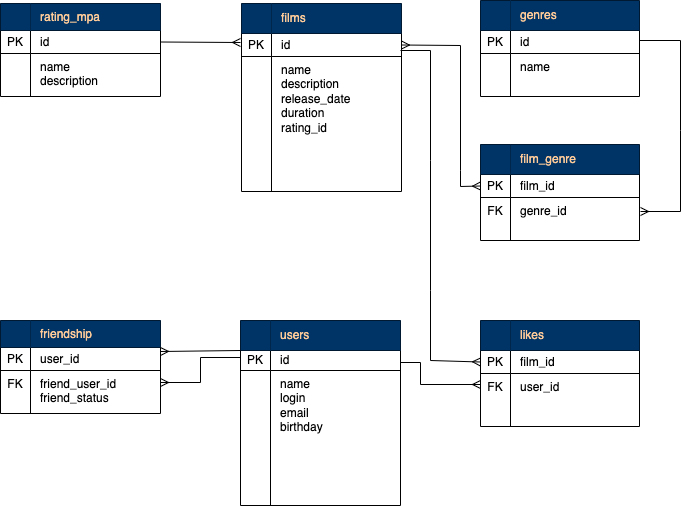

# Java-filmorate project

Данный проект -  бэкенд для сервиса, который будет работать с фильмами и оценками пользователей.
Технологии: Java, SpringBoot, Maven, JUnit, RESTful API, H2.

## Описание
С помощью данного сервиса можно:
- создать и обновить описание фильма;
- получать список всех фильмов;
- получать фильмы по ID;
- добавить или удалить лайк;
- создать и обновить описание пользователя;
- получить список всех пользователей;
- получать пользователя по ID;
- добавить или удалить друзей пользователя.

x
На диаграмме ниже представлен визуальный обзор базы данных Java-filmorate project и связей между таблицами.

[исходник](https://drive.google.com/file/d/17gcUk-WAB-lGO7vxh1_Y3huA4FsSxDjn/view)

В приведенном ниже обзоре Таблиц, содержатся дополнительные сведения о таблицах и столбцах базы данных.
- film: содержит данные о фильме.
- genre: у фильма может быть сразу несколько жанров, а у поля — несколько значений.
- rating: рейтинг Ассоциации кинокомпаний, эта оценка определяет возрастное ограничение для фильма.
- film_rating: таблица сопоставлений фильма и рейтинга.
- film_genre: таблица сопоставлений фильма и жанров.
- like: таблица лайков пользователей в разрезе фильмов.
- user: содержит данные о пользователе.
- friendship: содержит данные о друзьях пользователя.
- friend_status: : содержит данные о статусе дружбы (неподтверждённая, подтвержденная).

## Примеры SQL-запросов
Получить фильм по id:
```roomsql
SELECT *
FROM film 
WHERE film_id = 1;
```
Получить все названия фильмов, рейтинг которых R:
```roomsql
SELECT f.name
FROM film AS f
LEFT JOIN film_rating AS fr ON fr.film_id = f.film_id
LEFT JOIN rating AS r ON fr.rating_id = r.rating_id
WHERE r.name = 'G';
```
Получить фильмы жанр которых "комедия":
```roomsql
SELECT f.name
FROM film AS f
LEFT JOIN genre_films AS gf ON gf.film_id = f.film_id
LEFT JOIN genre AS g ON gf.genre_id=g.genre_id
WHERE g.name = 'comedy';
```
Вывести id подтвержденных друзей пользователя c id = 1:
```roomsql
SELECT f.name, fr.friend_user_id
FROM film AS f
LEFT JOIN friendship AS fr ON fr.user_id=f.user_id
LEFT JOIN friend_status AS fs ON fs.friend_status_id=fr.friend_status_id
WHERE fs.status = 'confirmed' ;
```

### Тестирование

В данном проекте добавлен с Spring Boot и с использованием нотации @SpringBootTest написано 26 юнит тестов.

### Групповой проект

Дальнейшая разработка данного приложения была реализована в групповом проекте.
https://github.com/CyberCoHuK/java-filmorate